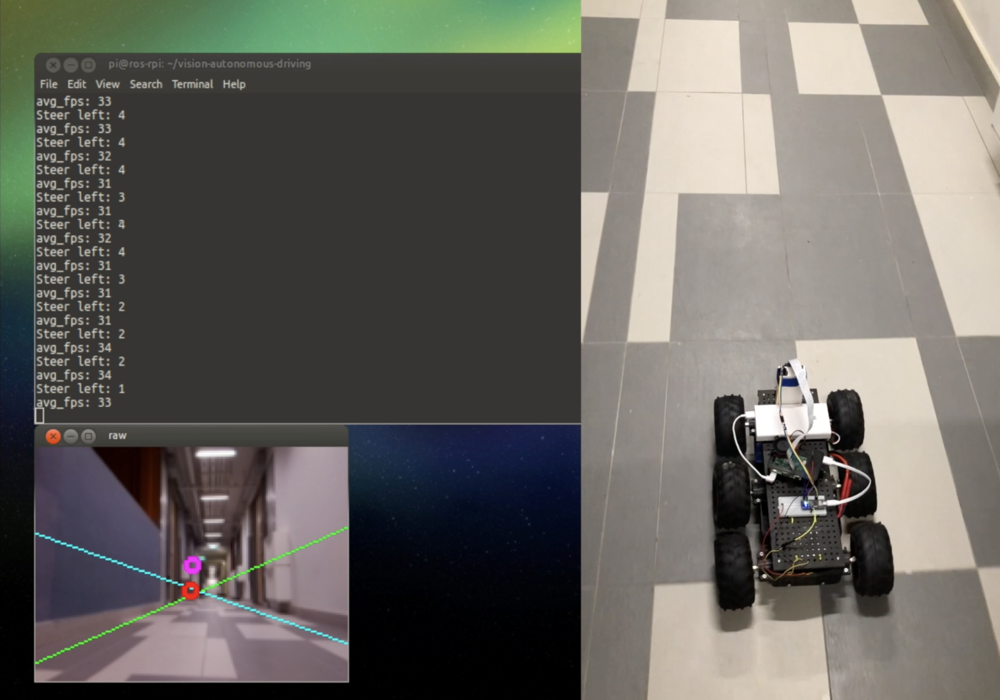

# Vision-based Autonomous Driving

An attempt to do robust self-driving using vision techniques on a physical platform.

### Platform

* Raspberry Pi 3 (Jetson TX1 - Planned)
* Chassis: Wild Thumper (differential drive)
* Pure Python

### Hardware Setup

* 6 DC motors driven by 2S Lithium-polymer cell
* Sabertooth 2x25A Regenerative Motor Driver ([link](https://www.dimensionengineering.com/products/sabertooth2x25)) (Serial mode)
* Arduino Nano to interface between Raspberry Pi and Sabertooth

### Software Implementation

* OpenCV for vanishing point detection
* (simple walkthrough: [notebook](https://github.com/tlkh/opencv-experiments/blob/master/Hough%20Line%20Transform.ipynb))

[Video](https://www.youtube.com/watch?v=fQrRkU2MiVI)

### In Progress

1. Camera calibration

### TODO

1. PID control
2. Integrate into ROS
3. Add more robust autonomy with mapping and localisation
4. Acceleration with CUDA on Jetson TX1
